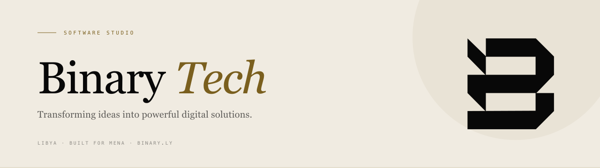

<picture>
  <source media="(prefers-color-scheme: dark)" srcset="./assets/header-dark.png">
  
</picture>

 

[**binary.ly**](https://binary.ly) &nbsp;·&nbsp; [info@binary.ly](mailto:info@binary.ly)

 

## We build software from Libya to the world.

Binary is a software studio based in Libya. We design and ship production systems — web applications, infrastructure, AI integrations, and data products — for teams that need work to actually run, not just demo.

 

## What we build

| | |
|:--|:--|
| **Web & product** | Customer-facing applications, internal tools, marketing surfaces. Laravel, Next.js, React, Vue. |
| **Infrastructure** | Self-hosted and managed deployments, CI/CD, edge delivery, observability. |
| **AI integrations** | Claude API agents, retrieval systems, structured-output pipelines, prompt-cached workloads. |
| **Data products** | Datasets, dashboards, ETL pipelines, government and civic-data work. |

 

## Principles

**01 — Precision over speed.** Every interface, API, and data model is designed with intention. Getting it right matters more than shipping fast.

**02 — Open by default.** We give back to the ecosystem that built us. Tools, packages, and datasets are released openly whenever possible.

**03 — Context matters.** Software built for Libya has to work for Libya: low bandwidth, Arabic script, real user behaviour, local constraints.

 

## Partnerships

<table>
<tr>
<td align="center" width="33%">

**Laravel** 
Community Partner · Live

</td>
<td align="center" width="33%">

**Hostinger** 
Infrastructure partner

</td>
<td align="center" width="33%">

**Anthropic** 
Claude API · Agent SDK

</td>
</tr>
</table>

 

## Connect

- **Web** — [binary.ly](https://binary.ly)
- **Email** — [info@binary.ly](mailto:info@binary.ly)
- **Location** — Libya · serving MENA

 

<i>Transforming ideas into powerful digital solutions.</i>

